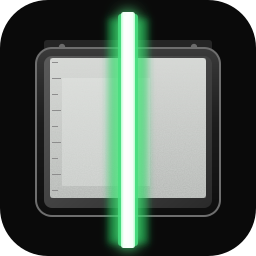

<a id="readme-top"></a>
<div align="center">
  <a href="https://github.com/PolyglotScan/polyglotscan/graphs/contributors"></a>
  <a href="https://github.com/PolyglotScan/polyglotscan/network/members"></a>
  <a href="https://github.com/PolyglotScan/polyglotscan/stargazers"></a>
  <a href="https://github.com/PolyglotScan/polyglotscan/issues"></a>
  <a href="https://github.com/PolyglotScan/polyglotscan/blob/main/LICENSE"></a>

  <br />
  

  <h3 align="center">PolyglotScan</h3>

  <p align="center">
    A native D scanner with a full-size, zoomable preview — so light receipts do not get crushed by a 200-pixel thumbnail.
    <br />
    <a href="docs/how-to/light-receipts.adoc"><strong>Explore the docs »</strong></a>
    <br />
    <br />
    <a href="https://github.com/PolyglotScan/polyglotscan/issues">Report Bug</a>
    ·
    <a href="https://github.com/PolyglotScan/polyglotscan/issues">Request Feature</a>
  </p>
</div>

<details>
<summary>Table of contents</summary>

- [About](#about)
- [Why not the official Epson SDK UI](#why-not-the-official-epson-sdk-ui)
- [Built With](#built-with)
- [Getting started](#getting-started)
- [Architecture](#architecture)
- [Trademark / naming](#trademark--naming)
- [License](#license)

</details>

## About

PolyglotScan talks to scanners through **standard** interfaces (WIA, TWAIN, eSCL) so Canon, Brother, HP, Epson, and others work from the same app. Vendor-specific extras live in plugins (`polyglotscan-epson`, later others). It saves **PDF, PNG, JPEG, and JPEG-XL**.

The UI problem this app exists to solve: Epson Scan 2 (the “advanced” app) exposes Threshold for black-and-white, but the preview pane is fixed and tiny, and Zoom/Loupe are disabled in modes where you need them most (thermal/ALDI-style receipts). PolyglotScan scans **grayscale once**, then lets you pan, zoom, and loupe a **full-window** preview while a threshold or Sauvola slider updates live — no re-scan per tick.

<p align="right">(<a href="#readme-top">back to top</a>)</p>

## Why not the official Epson SDK UI

| Path | Can we match Epson Scan 2? | Notes |
|------|----------------------------|-------|
| **Epson Scan SDK / TWAIN Custom Capabilities Kit** | Closest to driver-identity parity | Partner-gated. Not a public download. Do not redistribute. |
| **TWAIN 2** (Epson Scan 2 registers a source) | High for acquire/caps the driver exposes | Public spec + `TWAINDSM.dll`. This is the real “advanced” pipe. |
| **WIA** | Baseline acquire, fewer tone controls | Highest “just works on Windows” floor. |
| **eSCL (AirScan)** | Network/USB-eSCL subset | Cross-vendor, no OEM installer. |
| **Software tone (this app)** | **Better** than the official B&W preview for receipts | Adaptive threshold + 1:1 zoom; Epson’s global Threshold is the thing that was cutting receipts off. |

Feature **parity with the official UI** (ADF duplex jobs, film ICE, Text Enhancement as implemented in Epson’s process pipeline, ScanSmart cloud send, device maintenance tabs) is **not** a v0.1 claim. Feature **parity with “I can scan this receipt and read it”** is the goal, and it is achievable without the partner SDK.

<p align="right">(<a href="#readme-top">back to top</a>)</p>

## Built With

* **Language** — [![D][D-badge]][D-url]
* **App shell** — [![dlangui][dlangui-badge]][dlangui-url]
* **Site** — [![Solid][Solid-badge]][Solid-url]
* **Scan standards** — WIA · TWAIN · eSCL
* **Encode** — PNG / JPEG / PDF (native) · JPEG-XL via [jxl-d][jxl-url] or `cjxl`

[D-badge]: https://img.shields.io/badge/D-B03931?style=for-the-badge&logo=d&logoColor=white
[D-url]: https://dlang.org/
[dlangui-badge]: https://img.shields.io/badge/dlangui-003333?style=for-the-badge
[dlangui-url]: https://github.com/buggins/dlangui
[Solid-badge]: https://img.shields.io/badge/SolidStart-2c4f7c?style=for-the-badge&logo=solid&logoColor=white
[Solid-url]: https://start.solidjs.com/
[jxl-url]: https://github.com/dlang-supplemental/jxl-d

<p align="right">(<a href="#readme-top">back to top</a>)</p>

## Getting started

Need [DMD](https://dlang.org/download.html) or LDC, and [DUB](https://code.dlang.org/).

```powershell
cd $env:code\github.com\PolyglotScan\polyglotscan
dub run
```

Preview or **File → Open image** (a previous scan works). Wheel zooms, drag pans, right-mouse holds a loupe. Threshold and Sauvola apply to the grayscale original without talking to the scanner again.

<p align="right">(<a href="#readme-top">back to top</a>)</p>

## Architecture

Libraries, missing layers, and plugin naming: [docs/explanation/architecture.adoc](docs/explanation/architecture.adoc).

<p align="right">(<a href="#readme-top">back to top</a>)</p>

## Trademark / naming

Do **not** name this (or a DUB package) `epsonscan-d`. Epson is a trademark; that name reads as an official product. The Epson plugin is `polyglotscan-epson`: a third-party adapter, documented with nominative use of the vendor name. The product is **PolyglotScan** (`polyglotscan.com`, GitHub org `PolyglotScan`).

<p align="right">(<a href="#readme-top">back to top</a>)</p>

## License

**Software** (app, libraries, plugins, website source): [Brand Guardian License 1.0 Standard](LICENSE) ([steward](https://github.com/dev-centr/brand-guardian-license)). See [LICENSING.adoc](LICENSING.adoc). Where MPL would disagree, BGL wins.

**Brand** (name, SVG/PNG/ICO): reserved — [brand/LICENSE](brand/LICENSE). Store clones, ad-stuffed reuploads, and “remove ads” paywalls are [Prohibited Distribution](TRADEMARK.adoc).

<p align="right">(<a href="#readme-top">back to top</a>)</p>
